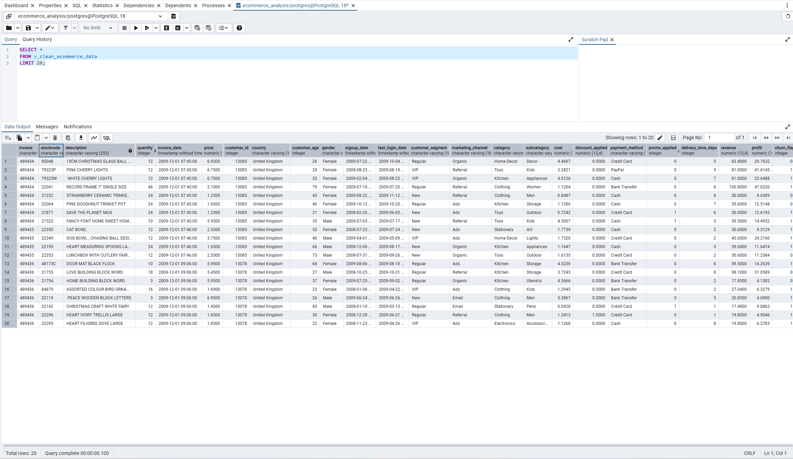

# Ecommerce SQL BI Analysis


## Overview

This project demonstrates an end-to-end Business Intelligence workflow using **PostgreSQL**, **SQL**, and **Power BI** to analyse over **743,000 retail transactions** from a synthetic e-commerce dataset.

After importing the raw dataset into PostgreSQL, a reusable reporting view was created to standardise data types and prepare the data for analysis. SQL was then used to answer key business questions through analytical queries covering sales performance, customer behaviour, product performance, marketing effectiveness, customer churn and product returns. The cleaned reporting layer was finally connected directly to Power BI to build an interactive executive dashboard.

The project demonstrates practical SQL skills used by Data Analysts and Business Intelligence Analysts, including database design, reporting views, aggregations, Common Table Expressions (CTEs), Window Functions and dashboard development.

---

## Business Problem

Retail businesses generate large volumes of transactional data, but raw operational databases are rarely structured for reporting.

The objective of this project was to build a reusable SQL reporting layer that could answer common business questions including:

- How much revenue and profit is the business generating?
- Which customers and products generate the highest value?
- Which marketing channels perform best?
- How do sales change month-to-month?
- What impact do discounts and returns have on profitability?
- Which customer segments are most valuable?

The finished SQL model provides a scalable foundation for Power BI dashboards and executive reporting.

---

## Dataset

**Synthetic E-Commerce Sales Dataset**

Approximately:

- **743,486 transactions**
- **38,978 orders**
- **5,000 customers**
- Multiple countries
- Customer demographics
- Product hierarchy
- Marketing channels
- Returns (credit-note invoices)
- Churn indicators

Unlike the spreadsheet-based cleaning performed in **Project 1**, this SQL project preserves anonymous transactions (orders without customer IDs) to maintain accurate financial reporting while filtering customer-level analyses only where appropriate.

---

## Data Preparation

The reporting layer was built inside PostgreSQL using a reusable SQL view.

### SQL Reporting View



Key preparation steps included:

- Importing the raw CSV dataset into PostgreSQL
- Creating the `sales_data` table
- Building the reusable `v_clean_ecommerce_data` reporting view
- Casting text fields into appropriate numeric and timestamp data types
- Removing invalid invoices
- Preserving anonymous transactions with NULL customer IDs
- Creating a consistent reporting layer for Power BI

---

## SQL Analysis

SQL scripts cover multiple areas of business analysis.

### Sales Overview

- Executive KPIs
- Monthly Revenue
- Monthly Profit
- Running Revenue Totals

### Customer Analysis

- Top Customers
- Customer Segments
- Average Customer Age
- Customer Rankings

### Product Analysis

- Revenue by Category
- Revenue by Subcategory
- Top Products

### Country Analysis

- Revenue by Country
- Customer Distribution

### Marketing Analysis

- Revenue by Marketing Channel
- Profit by Marketing Channel

### Discount Analysis

- Discount vs Non-discount Performance

### Churn Analysis

- Revenue and Profit by Churn Status

### Returns Analysis

- Return Rate
- Cancelled Invoice Analysis

### Intermediate SQL

The project also demonstrates intermediate SQL concepts commonly used in Business Intelligence.


Topics covered include:

- Common Table Expressions (CTEs)
- Window Functions
- LAG()
- ROW_NUMBER()
- RANK()
- DENSE_RANK()
- Running Totals
- Month-on-Month Growth Analysis

---

## Dashboard

| Executive Dashboard | Customer Analysis |
|---------------------|-------------------|
|  |  |

| Product Analysis | Marketing & Returns |
|------------------|---------------------|
|  |  |

The Power BI dashboard connects directly to the PostgreSQL reporting view and includes:

- Executive KPI cards
- Revenue and Profit trends
- Customer segmentation
- Product performance
- Country analysis
- Marketing performance
- Interactive filtering
- Returns analysis

---

## Results

The completed reporting solution analysed **743,486 cleaned transactions**, producing the following business KPIs.

| KPI | Value |
|------|------:|
| Total Revenue | **£13.41M** |
| Total Profit | **£5.39M** |
| Orders | **38,978** |
| Registered Customers | **≈5,000** |
| Average Transaction Value | **£20.06** |
| Return Rate | **5.67%** |

### Key Findings

- Generated over **£13.4 million** in revenue across nearly **39,000** completed orders.
- Overall profit exceeded **£5.39 million**, demonstrating healthy profitability.
- Product categories contributed unevenly to revenue, highlighting opportunities for inventory optimisation.
- Marketing channels produced noticeably different profitability despite similar customer volumes.
- Month-on-month trend analysis identified clear seasonal changes in both revenue and profit.
- Approximately **5.7%** of invoices represented returns (credit-note transactions), reinforcing the importance of reporting returns separately from completed sales.
- Retaining anonymous transactions (NULL customer IDs) preserved complete financial reporting while allowing customer-level analyses to focus on registered customers only.

---

## Technologies

### Languages

- SQL

### Database

- PostgreSQL

### Business Intelligence

- Power BI Desktop

### Development Tools

- pgAdmin 4
- Visual Studio Code
- Git
- GitHub

---

## Repository Structure

```text
ecommerce-sql-bi-analysis/

│── data/
│   └── raw/

│── images/
│   ├── dashboard-overview.png
│   ├── dashboard-customers.png
│   ├── dashboard-products.png
│   ├── dashboard-marketing-returns.png
│   ├── sql-reporting-view.png
│   ├── sql-sales-overview-query.png
│   ├── sql-month-over-month-growth.png
│   └── sql-window-functions.png

│── powerbi/
│   └── Ecommerce_Dashboard.pbix

│── sql/
│   ├── 01_init_sales_schema.sql
│   ├── 02_transform_sales_view.sql
│   ├── 03_analytics_mom_metrics.sql
│   ├── 04_sales_overview.sql
│   ├── 05_customer_analysis.sql
│   ├── 06_product_analysis.sql
│   ├── 07_country_analysis.sql
│   ├── 08_marketing_analysis.sql
│   ├── 09_discount_analysis.sql
│   ├── 10_churn_analysis.sql
│   ├── 11_intermediate_analysis.sql
│   └── 12_returns_analysis.sql

└── README.md
```

---

## Next Project

➡ **Python Monthly Reporting Pipeline**

The next project builds on the SQL reporting layer developed here by introducing Python automation. Using the Brazilian Olist dataset, it automates data ingestion, cleaning, KPI generation and monthly reporting through a reusable ETL pipeline. Together, the three portfolio projects demonstrate progression from spreadsheet transformation, to SQL analytics, to automated reporting workflows.

**Repository:** https://github.com/pahenda-analytics/python-monthly-reporting-pipeline

---
