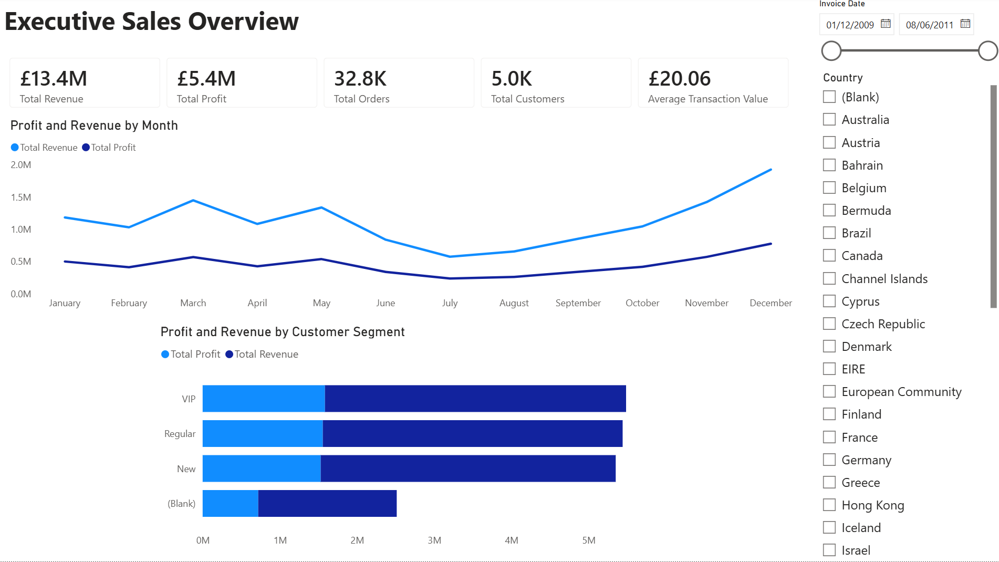
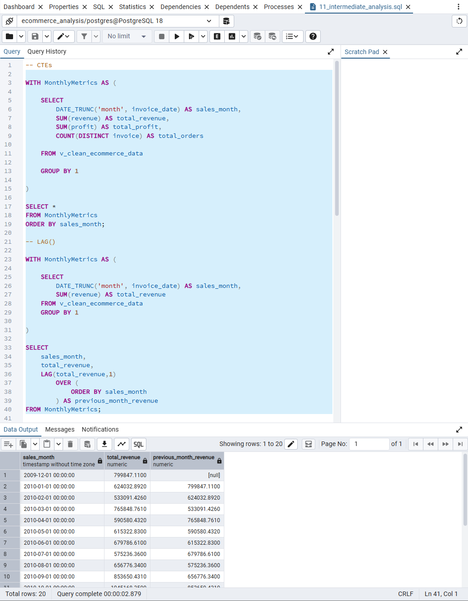
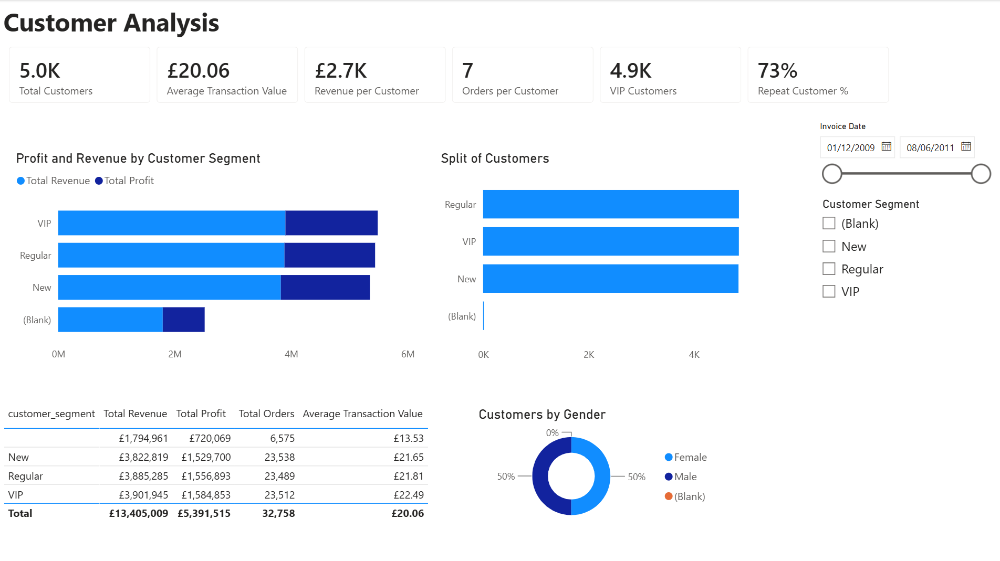
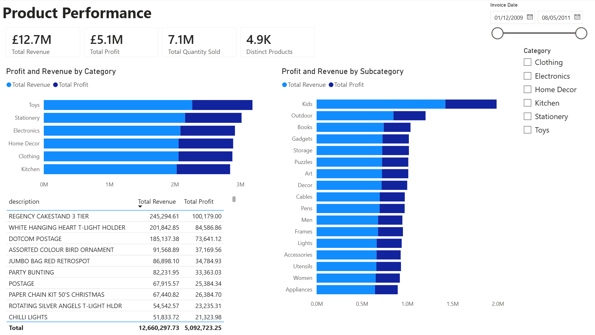
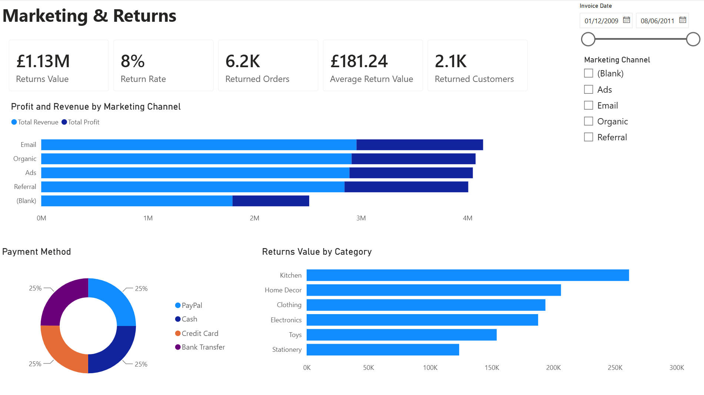

# Project 2 – SQL Business Intelligence Analysis



## Overview

This project demonstrates an end-to-end Business Intelligence workflow using **PostgreSQL**, **SQL**, and **Power BI** to analyse a large e-commerce sales dataset containing over **743,000 transactions**.

Building on the data cleaning completed in Project 1, the dataset was imported into PostgreSQL where a reusable analytical view was created to standardise the data for reporting. SQL was then used to answer key business questions, generate business KPIs, and perform customer, product, marketing, churn and returns analysis. Finally, the cleaned dataset was connected to Power BI to create an interactive executive dashboard.

The project demonstrates how SQL can be used not only for querying data, but also for creating scalable reporting datasets that support Business Intelligence solutions.

---

## Objectives

- Import a large transactional dataset into PostgreSQL
- Create a reusable SQL analytical view for reporting
- Clean and standardise data using SQL transformations
- Analyse business performance using SQL queries
- Demonstrate intermediate SQL concepts including CTEs and Window Functions
- Build an interactive Power BI dashboard
- Produce business insights suitable for executive reporting

---

## Dataset

**Dataset:** Synthetic E-Commerce Sales Dataset

The dataset contains approximately **743,000 retail transactions** across multiple business dimensions, including:

- Sales Transactions
- Products
- Customers
- Customer Demographics
- Marketing Channels
- Countries
- Revenue
- Profit
- Discounts
- Delivery Information
- Customer Churn Indicators

Unlike Project 1, this project retains all valid transactional records—including anonymous purchases without customer IDs—to preserve financial reporting accuracy. Customer-specific analyses apply filtering only where appropriate.

---

## Methodology / Workflow

### 1. Database Creation

- Imported the raw dataset into PostgreSQL
- Created the `sales_data` table
- Verified successful data import

### 2. SQL Data Transformation

Created the reusable analytical view:

`v_clean_ecommerce_data`

Transformations included:

- Data type conversions
- Date formatting
- Integer casting
- Removal of invalid invoices
- Preservation of anonymous customer transactions
- Creation of a standardised reporting layer

### 3. Business KPI Analysis

Developed SQL scripts covering:

- Sales Overview
- Customer Analysis
- Product Analysis
- Country Analysis
- Marketing Analysis
- Discount Analysis
- Churn Analysis
- Returns Analysis

### 4. Intermediate SQL Techniques



Applied more advanced SQL features including:

- Common Table Expressions (CTEs)
- Window Functions
- LAG()
- ROW_NUMBER()
- RANK()
- DENSE_RANK()
- Running Totals
- Month-on-Month Growth Analysis

### 5. Business Intelligence Dashboard

| Executive Dashboard | Customer Analysis |
|---------------------|-------------------|
|  |  |

| Product Analysis | Marketing & Returns |
|------------------|---------------------|
|  |  |

Connected PostgreSQL directly to Power BI and developed an interactive dashboard featuring:

- Executive KPIs
- Sales Trends
- Customer Analysis
- Product Performance
- Marketing Performance
- Returns Analysis

---

## Key Findings

Analysis of the dataset highlighted several important business insights:

- Revenue and profitability trends varied across product categories and customer segments.
- Marketing channel performance showed clear differences in revenue generation.
- Returns (credit-note invoices) represented a measurable impact on overall profitability and required separate KPI reporting.
- Preserving anonymous transactions maintained complete financial reporting while allowing customer-focused analyses to filter registered customers only.
- Month-on-month trend analysis provided a clearer view of revenue growth and seasonal performance.

---

## Repository Structure

```text
sql-bi-analysis/

│── data/
│    └── raw/

│── sql/
│    ├── 01_create_table.sql
│    ├── 02_transform_sales_view.sql
│    ├── 03_sales_overview.sql
│    ├── 04_customer_analysis.sql
│    ├── 05_product_analysis.sql
│    ├── 06_country_analysis.sql
│    ├── 07_marketing_analysis.sql
│    ├── 08_discount_analysis.sql
│    ├── 09_churn_analysis.sql
│    ├── 10_intermediate_analysis.sql
│    └── 11_returns_analysis.sql

│── dashboard/
│    └── Ecommerce_Dashboard.pbix

│── screenshots/

│── docs/

└── README.md
```

---

## Skills Demonstrated

### SQL

- PostgreSQL
- Data Transformation
- Views
- Aggregations
- CASE Statements
- GROUP BY
- HAVING
- ORDER BY
- CTEs
- Window Functions
- Running Totals
- Time-Series Analysis

### Business Intelligence

- KPI Development
- Executive Reporting
- Dashboard Design
- Data Visualisation
- Interactive Filtering

### Analytical Skills

- Sales Performance Analysis
- Customer Analytics
- Product Analytics
- Marketing Analytics
- Returns Analysis
- Churn Analysis
- Business Insight Generation

### Tools

- PostgreSQL
- pgAdmin 4
- SQL
- Power BI Desktop
- GitHub

---

## Project Outcome

This project demonstrates the complete Business Intelligence workflow from raw transactional data to executive reporting.

Compared with Project 1, the analysis moves beyond spreadsheet-based cleaning into relational databases and SQL-driven analytics, showcasing industry-standard practices used by Data Analysts and Business Intelligence professionals. The resulting PostgreSQL reporting layer provides a scalable foundation for Power BI dashboards while demonstrating intermediate SQL techniques commonly required in analyst roles.

---

## Next Project

➡ **Project 3 – Python Data Automation Pipeline**

The next project builds upon the SQL reporting layer developed here by introducing Python automation. Using the multi-table Brazilian Olist dataset, the project automates data ingestion, cleaning, KPI generation and reporting through a reusable ETL pipeline. This demonstrates how Python can complement SQL and Business Intelligence tools to automate recurring analytical workflows.

[def]: images/dashboard_overview.png